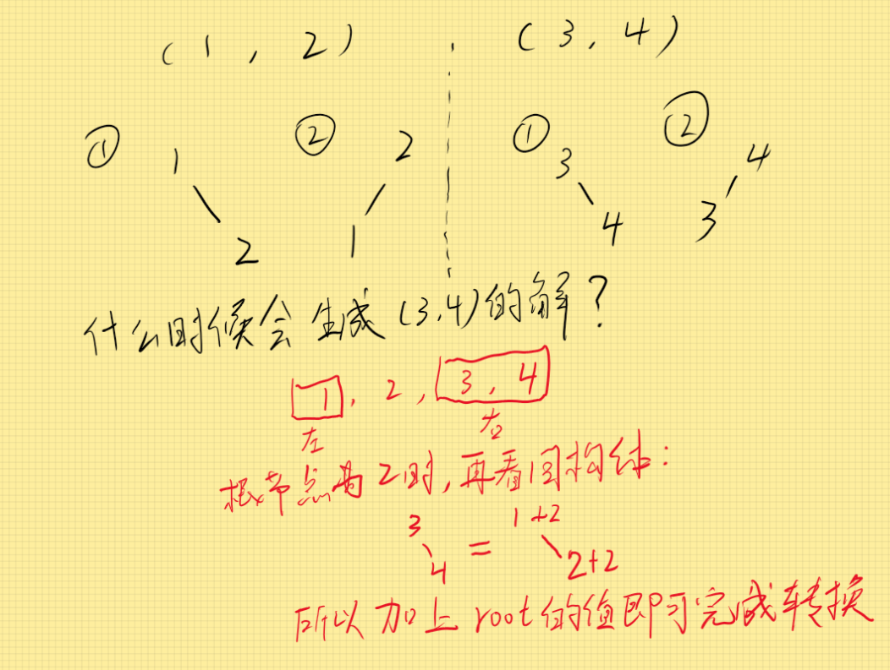

# 不同的二叉搜索树II

## 递归方法


## 动态规划

这是递归方法的自底向上的实现形式。早在“96-不同的二叉搜索树”中，我们就发现，对于形如$1, \dots, n$的序列，其不同的二叉搜索树的个数$G(x)$只取决于序列长度，例如$G_{(1, 2, 3)}=G_{(2,3,4)}=G(3)$。这是因为，相同长度的序列，它们中任一序列所有解都在其他序列的解中，都有对应的同构体。

其规律可表示如下：



弄清楚了相同长度的序列的解之间的关系，我们设置$dp[i]$表示长度为$i$的序列的解中，最靠近序列头部的一个解。

我们对长度由短到长进行遍历，同时顺序对每一个元素视为根节点进行遍历，这样在状态转移时，我们需要考虑的是：
$$
dp[l]=节点左边序列的解 \Join 节点右边序列的解
$$
由于$dp[left]$表示的是当前序列中从1开始的某个序列子集，即等于节点左边序列的解，因此不需要进行额外操作。但$dp[right]$表示的也是当前序列中以1开始的某个子集，与我们所需要的“节点右边序列的解”不相同，我们需要借助上面总结出的规律，来对它进行拷贝并修改得到$copyr$，不破坏$dp[right]$，最终的转移方程为：
$$
dp[l]=dp[left]\Join copyr
$$
拷贝部分的代码是这样写的，其中src应传入$dp[right]$的指针，val传入节点值。

```c++
TreeNode* copy(TreeNode* src, int val) {
        if (!src) return nullptr;
        TreeNode* root = new TreeNode(src->val + val);
        root->left = copy(src->left, val);
        root->right = copy(src->right, val);
        return root;
}
```


